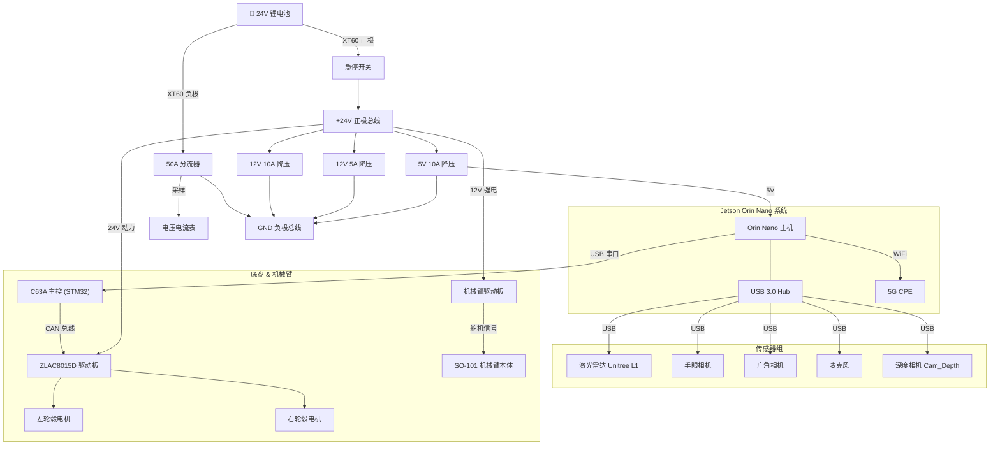
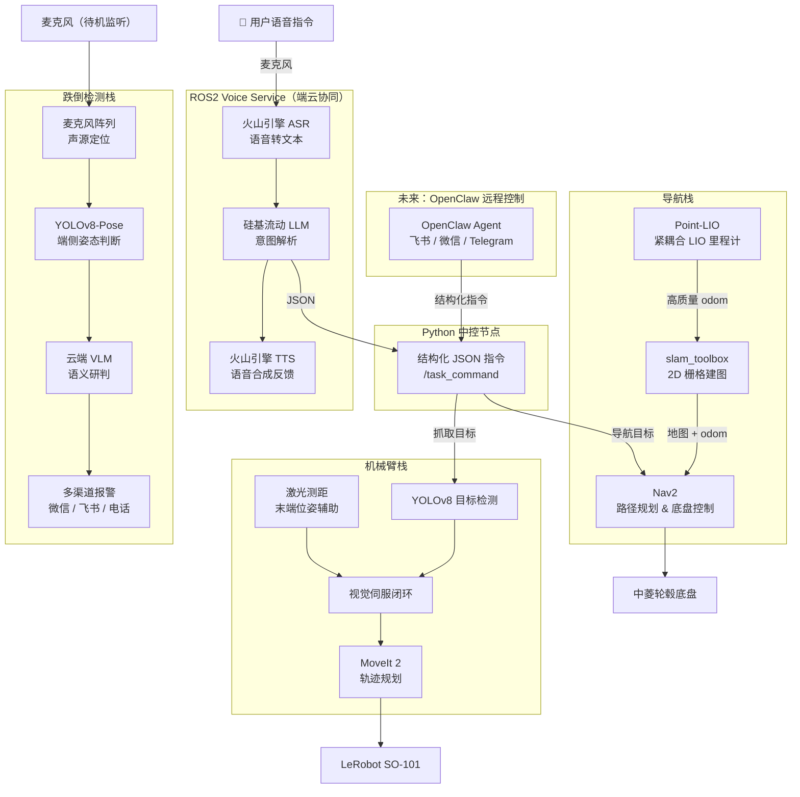

# 基于 ROS 2 与端云协同架构的具身智能助老机器人
**Project LINK · 灵犀**

---

## 实车


---

## 项目简介

**灵犀**是一台面向居家老年用户的语音控制移动操作机器人。老年人在体力下降、行动不便的场景下，往往面临两类核心需求：**日常取物**与**意外应急**。灵犀通过端云协同的方式将自然语言理解、自主导航与机械臂操作融合为一体，让老人只需开口说话，机器人完成剩下所有的事。

系统采用"端侧小脑 + 云端大脑"的混合架构：运动控制、视觉感知等低延迟任务在 Jetson Orin Nano 端侧完成，自然语言理解、意图解析等复杂推理通过云端 LLM 处理，两者通过 ROS 2 消息总线协同。

---

## 核心功能

### 场景一：助老递药

老人呼唤"小灵"唤醒机器人后，发出自然语言指令：

> *"帮我把桌上的药拿过来。"*

灵犀完成以下完整闭环：

1. **唤醒** — 本地离线唤醒词检测（Porcupine / OpenWakeWord），低功耗待机
2. **听觉** — 麦克风收音，火山引擎 ASR 实时流式语音转文本
3. **思考** — 调用云端 LLM（硅基流动）解析意图，输出结构化 JSON 指令：
   ```json
   {
     "intent": "fetch_object",
     "target": "medicine_bottle",
     "location": "living_room_table",
     "urgency": "high"
   }
   ```
4. **导航** — Nav2 接收目标坐标，规划路径，底盘锁死于目标点
5. **抓取** — 广角相机粗定位，手眼相机视觉伺服微调，SO-101 机械臂闭合夹爪
6. **返回** — 药瓶放入顶部托盘，返回用户位置
7. **反馈** — 火山引擎 TTS 播报："药拿来了，请按时服用。"

---

### 场景二：智能跌倒检测与多模态应急响应

系统摒弃"全时视觉监控"方案，采用**音频触发 → 视觉确认 → 云端研判 → 多渠道报警**的三级响应机制，在隐私保护与检测准确率之间取得平衡。

1. **听觉触发** — 待机时仅开启低功耗麦克风阵列，检测到高危唤醒词（"救命"、"哎哟"）或高分贝撞击声时立即唤醒；利用声源定位（SSL）算法驱动底盘转向声源并导航至目标附近
2. **端侧视觉几何确认** — 到达现场后调用 YOLOv8-Pose 检测人体关键点，计算头部与脚踝垂直高度差；若身体呈水平姿态（`Head_Y ≈ Ankle_Y`）且宽高比异常则初步判定为"疑似跌倒"；此步在端侧完成，无需上传任何图像，保护用户隐私
3. **云端 VLM 语义研判** — 锁定目标后拍摄现场照片上传至云端多模态大模型（GPT-4o Vision / MiniCPM-V）进行语义理解，并合成关切语音与老人交互：

   > *"检测到您摔倒了，您现在感觉怎么样？需要帮您报警吗？"*

4. **多渠道报警** — 进入 15 秒监听窗口，若收到求救指令或持续沉默，触发全渠道报警：微信 / 飞书推送现场照片 + VLM 描述至监护人，并调用云通信 API 直接拨打紧急联系人电话

---

## 未来规划

### OpenClaw 远程自然语言控车

计划接入 [OpenClaw](https://openclaw.ai) Agent 框架，实现通过**飞书 / 微信 / Telegram** 等即时通讯工具以自然语言远程操控机器人：

> *"去客厅看看奶奶在干什么"*  
> *"帮我拍一下冰箱里还有什么"*  
> *"去书房等我，我五分钟后过去"*

OpenClaw 负责对话管理与工具调用编排，ROS 2 作为执行层接收结构化指令，无需额外开发复杂的对话状态机。

---

## 硬件架构



---

## 软件架构



---

## SLAM 建图演示


---

## 子系统状态

### AGV 底盘 `私有仓库 · 开发中`

**现状：**
- STM32 轮式里程计 + L1 点云切片 2D scan → `slam_toolbox` 建图可运行，但回环失败
- 根因：L1 振动经铝型材传导导致内置 IMU 不可用；2D 切片特征量不足

**下一步：**
- 引入 [`point_lio_ros2`](https://github.com/dfloreaa/point_lio_ros2)：L1 点云 + L1 内置 IMU 紧耦合 LIO，输出高质量里程计替代轮式里程计
- 跑通后接入 Nav2，初始位姿通过 RViz 手动标定

**技术栈：** ROS 2 Humble · Jetson Orin Nano · STM32 · ZLAC8015D · Unitree L1 · slam_toolbox · Point-LIO · Nav2

---

### ROS2 Voice Service [`XWen1024/ROS2_Voice_Service`](https://github.com/XWen1024/ROS2_Voice_Service) `已开源 · 活跃`

**现状：**
- ASR → LLM → TTS 全链路跑通，功能稳定
- 尚未接入 ROS 2，目前使用模拟桩进行集成测试

**下一步：**
- 封装为 ROS 2 节点，向 `/task_command` 话题发布结构化指令
- 探索端到端流式模型以降低交互延迟

**技术栈：** Python · 火山引擎 ASR/TTS · 硅基流动 LLM · SSML · ROS 2

---

### SO-101 视觉伺服抓取 [`XWen1024/LeRobot_SO101_Visual_Servo`](https://github.com/XWen1024/LeRobot_SO101_Visual_Servo) `已开源 · 调试中`

**现状：**
- 基础抓取可用，视觉伺服闭环运行
- 近距离深度估计存在偏差，抓取精度仍在调整

**下一步：**
- 在机械臂末端加装激光测距模块，替代深度相机在最终接近阶段的距离估算

**技术栈：** Python · LeRobot SO-101 · YOLOv8 · ROS 2 · MoveIt 2

---

## Roadmap

- [ ] Point-LIO 里程计接入 → slam_toolbox 回环稳定
- [ ] Nav2 全导航栈调通
- [ ] Voice Service 封装为 ROS 2 节点，替换模拟桩
- [ ] 机械臂末端激光测距模块集成
- [ ] 语音 → 导航 → 抓取 → 返回 全流程端到端演示
- [ ] 跌倒检测模块集成
- [ ] OpenClaw 接入，支持飞书 / 微信 / Telegram 远程自然语言控车

---

## 相关仓库

| 仓库 | 说明 |
|---|---|
| [`XWen1024/LeRobot_SO101_Visual_Servo`](https://github.com/XWen1024/LeRobot_SO101_Visual_Servo) | SO-101 机械臂视觉伺服抓取 |
| [`XWen1024/ROS2_Voice_Service`](https://github.com/XWen1024/ROS2_Voice_Service) | 语音交互全链路服务 |
| AGV 底盘 | 暂不开源 |
